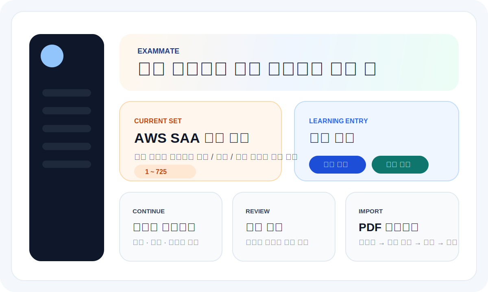
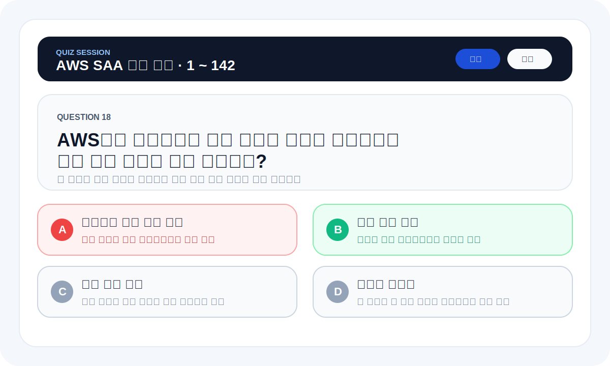
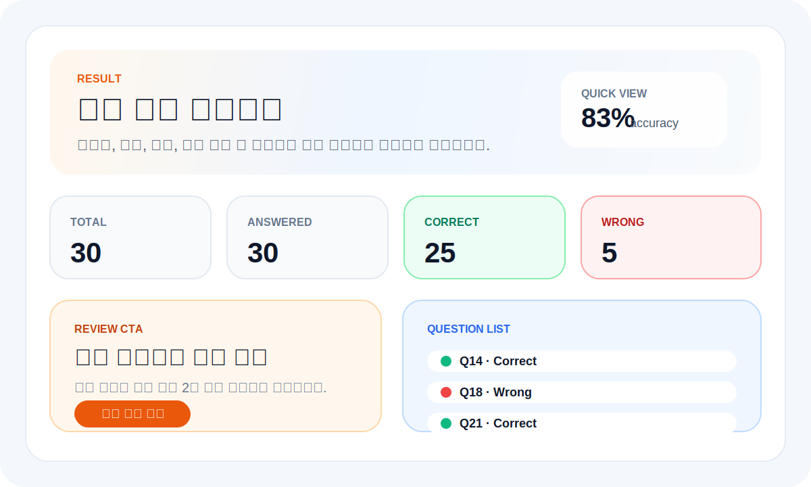
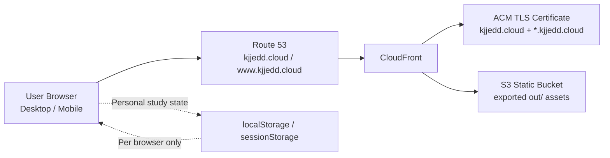

# ExamMate

> AWS SAA 학습을 위해 만든 범위 지정형 문제풀이 웹앱  
> PDF 가져오기, 세트별 이어풀기, 오답 복습, 즐겨찾기, 시험 모드까지 한 흐름으로 제공합니다.

[](https://nextjs.org/)
[](https://react.dev/)
[](https://www.typescriptlang.org/)
[](https://tailwindcss.com/)
[](https://aws.amazon.com/cloudfront/)

## Live

- Production: [https://kjjedd.cloud](https://kjjedd.cloud)
- Alternate: [https://www.kjjedd.cloud](https://www.kjjedd.cloud)

## Deployment Status

- Production deployment: **healthy**
- Latest production source: [`main`](https://github.com/Kjjedd/exam-practice-app/tree/main)
- Latest verified deploy run: [GitHub Actions #24661793143](https://github.com/Kjjedd/exam-practice-app/actions/runs/24661793143)

## Product Preview

### Home



### Quiz



### Result



## Demo GIF

짧은 제품 흐름을 README 안에서 바로 볼 수 있도록 애니메이션 프리뷰를 넣었습니다.


## Overview

ExamMate는 단순한 퀴즈 페이지가 아니라, **실제 학습 루프를 끝까지 이어주는 시험 대비 앱**입니다.

사용자는 다음 흐름으로 학습할 수 있습니다.

1. 기본 문제 세트 또는 PDF 기반 문제 세트 선택
2. 문제 번호 범위를 직접 지정해서 학습 시작
3. 일반 / 랜덤 / 시험 모드로 풀이
4. 결과 요약 확인
5. 오답만 다시 복습
6. 즐겨찾기와 대시보드로 학습 상태 점검

특히 이 프로젝트는 **브라우저 개인 저장 기반**으로 설계되어, 서버 비용 없이도 세트별 이어풀기, 즐겨찾기, 오답 복습 흐름을 유지합니다.

## What It Does

### 1. 문제 세트 기반 학습

- 기본 내장 AWS SAA 문제 세트 제공
- 추가 PDF 업로드 후 문제 후보 자동 변환 및 검수
- 활성 문제 세트 전환 지원
- 문제 세트별 독립 학습 상태 유지

### 2. 범위 지정 학습

- 예: `1 ~ 142`, `600 ~ 725`
- 일반 / 랜덤 / 시험 모드 모두 범위 지정 적용
- 세트 전체가 아니라 **선택한 범위 기준**으로 세션 생성

### 3. 세 가지 풀이 모드

- **일반 모드**
  - 자유롭게 이전/다음 문제 이동
  - 바로 풀이하고 학습하기 좋은 모드
- **랜덤 모드**
  - 선택한 범위 안에서만 문제 셔플
  - 복습용 반복 학습에 적합
- **시험 모드**
  - 기본 AWS SAA 세트에서만 사용 가능
  - 즉시 채점 없이 마지막 결과에서 한 번에 확인
  - 실제 시험처럼 답안 저장 중심의 흐름 제공

### 4. 학습 상태 복원

- 문제 세트별 이어풀기 세션
- 세트/범위/모드별 독립 복원
- 홈으로 나갔다가 다시 들어와도 진행 상태 유지
- 필요하면 현재 세션만 삭제 또는 처음부터 다시 시작 가능

### 5. 결과, 오답 복습, 즐겨찾기

- 결과 요약 대시보드
- 문제별 정답 / 오답 / 미응답 상태 확인
- 세트별 오답만 다시 복습
- 2차 오답 복습 흐름 지원
- 세트별 즐겨찾기 목록 확인 및 개별 삭제 가능

### 6. PDF 가져오기 흐름

- PDF 선택
- 파일 검증
- 자동 변환
- 검수 및 수정
- 문제 세트 저장

현재 PDF 업로드는 브라우저 환경에서 처리하기 때문에 **25MB 이하 PDF**만 지원합니다.

## Key Features

| Feature | Description |
| --- | --- |
| Default Question Sets | AWS SAA 전체 세트, AWS SAA 600~1019 세트 제공 |
| Range-based Sessions | 시작/끝 번호를 지정해 필요한 범위만 학습 |
| Per-set Progress | 문제 세트별 이어풀기 세션 독립 저장 |
| Per-set Favorites | 문제 세트별 즐겨찾기 저장 및 삭제 |
| Per-set Wrong Answers | 문제 세트별 오답 저장, 복습, 삭제 |
| Exam Flow | 시험형 풀이, 즉시 채점 비활성화 |
| Result Dashboard | 정답률, 응답 수, 오답 수 요약 |
| Mobile Optimization | 모바일에서 한 화면에 핵심 정보가 먼저 보이도록 최적화 |

## Screens and User Flow

### Home

- 현재 활성 문제 세트 확인
- 범위 지정
- 일반 / 랜덤 / 시험 시작
- 이어풀기 / 다시 시작

### Quiz

- 긴 문제를 읽기 쉽게 정리한 문제 카드
- 정답/오답 하이라이트
- 시험 모드에서는 즉시 채점 없이 답안만 저장
- 모바일 화면 밀도 최적화

### Result

- 세션 요약 카드
- 정답률, 정답 수, 오답 수, 미응답 수
- 문제별 결과 리스트
- 오답 복습 CTA

### Review / Favorites / Dashboard

- 현재 세트 기준 복습
- 현재 세트 기준 즐겨찾기
- 최근 완료 세션 기준 통계 확인

## Personal Storage Model

이 앱은 서버 DB 대신 **브라우저 저장소(localStorage / sessionStorage)** 를 사용합니다.

이 구조의 의미는 다음과 같습니다.

- 기본 문제 세트는 모든 사용자에게 동일하게 제공됩니다.
- 사용자가 업로드한 PDF 기반 문제 세트는 **해당 브라우저에만 저장**됩니다.
- 같은 계정이라도 **다른 기기 / 다른 브라우저에는 자동 동기화되지 않습니다.**
- 브라우저 데이터를 삭제하면 개인 업로드 세트와 학습 상태도 함께 사라질 수 있습니다.

즉, **공통 기본 세트 + 사용자별 개인 브라우저 저장** 구조입니다.

## Tech Stack

- **Framework**: Next.js 15 (App Router)
- **UI**: React 19
- **Language**: TypeScript
- **Styling**: Tailwind CSS
- **Storage**: localStorage, sessionStorage
- **Deploy**: AWS S3 + CloudFront + ACM + Route 53

## Project Structure

```text
app/
  dashboard/
  exam/
  favorites/
  import/
  quiz/
  result/
  review/

components/
  dashboard/
  exam/
  favorites/
  home/
  import/
  question/
  result/
  review/

data/
  default-question-set.json
  default-question-set-saa-600-plus.json

lib/
  data/
  dashboard/
  exam/
  import/
  quiz/
  storage/
  types/

plans/
  feature-*/
  fix-*/
  refactor-*/
```

## Local Development

### Install

```bash
npm install
```

### Run

```bash
npm run dev
```

### Type Check

```bash
npm run typecheck
```

### Production Build

```bash
npm run build
```

## Deployment

이 프로젝트는 정적 export 결과물을 AWS에 배포합니다.

배포 구성:

- S3
- CloudFront
- ACM
- Route 53

### CI/CD

이 저장소는 GitHub Actions로 자동 배포됩니다.

- `pull_request -> main`
  - `typecheck`
  - `build`
- `push -> main`
  - `typecheck`
  - `build`
  - `aws s3 sync`
  - `CloudFront invalidation`

워크플로우 파일:

- [`deploy.yml`](/Users/jongeon/Desktop/Study/exam-practice-app/.github/workflows/deploy.yml)

빌드 후 배포 예시:

```bash
npm run build
aws s3 sync out/ s3://YOUR_BUCKET_NAME --delete
aws cloudfront create-invalidation --distribution-id YOUR_DISTRIBUTION_ID --paths "/*"
```

## Deployment Architecture



배포 구성의 핵심은 다음과 같습니다.

- **S3**: 정적 export 결과물 보관
- **CloudFront**: HTTPS, 캐시, 전 세계 배포
- **ACM**: 커스텀 도메인 TLS 인증서
- **Route 53**: `kjjedd.cloud`, `www.kjjedd.cloud` 연결
- **Browser Storage**: 사용자별 문제 세트, 즐겨찾기, 이어풀기, 오답 상태 저장

## Branch Strategy

이 프로젝트는 단순한 운영 흐름을 유지합니다.

- `main`
  - 배포 기준 브랜치
  - 머지되면 GitHub Actions가 자동 배포
- `feature/*`
  - 기능 개발 브랜치
  - 예: `feature/range-based-set-flow`
- `fix/*`
  - 버그 수정 브랜치
- `refactor/*`
  - 내부 구조 정리 브랜치

권장 흐름:

1. `feature/*`, `fix/*`, `refactor/*` 브랜치에서 작업
2. PR로 검증
3. `main` 머지
4. 자동 배포

## Current Product Notes

- 시험 모드는 현재 **기본 AWS SAA 세트**에서만 사용 가능합니다.
- 업로드한 PDF 문제 세트는 **일반 모드 / 랜덤 모드** 중심으로 사용하도록 설계되어 있습니다.
- PDF 자동 변환은 휴리스틱 기반이라, 파일 형식에 따라 검수 단계에서 수동 보정이 필요할 수 있습니다.

## Why This Project

이 프로젝트는 다음 문제를 해결하기 위해 만들었습니다.

- 큰 문제 세트를 원하는 범위만 나눠서 학습하고 싶다
- 한 번 틀린 문제를 다시 다시 반복해서 보고 싶다
- 문제 세트별로 학습 상태를 따로 유지하고 싶다
- 서버 비용 없이 개인 학습용 웹앱을 운영하고 싶다

결국 ExamMate는 **문제풀이 자체보다 학습 지속성과 복습 흐름**에 더 집중한 앱입니다.

## Roadmap

- PDF 변환 정확도 개선
- 더 안정적인 모바일 UX
- 업로드 세트용 메타데이터/분류 개선
- 결과 화면 시각화 고도화

## License

개인 학습 및 프로젝트 용도로 관리 중입니다.  
필요 시 별도 라이선스 정책을 추가할 수 있습니다.
