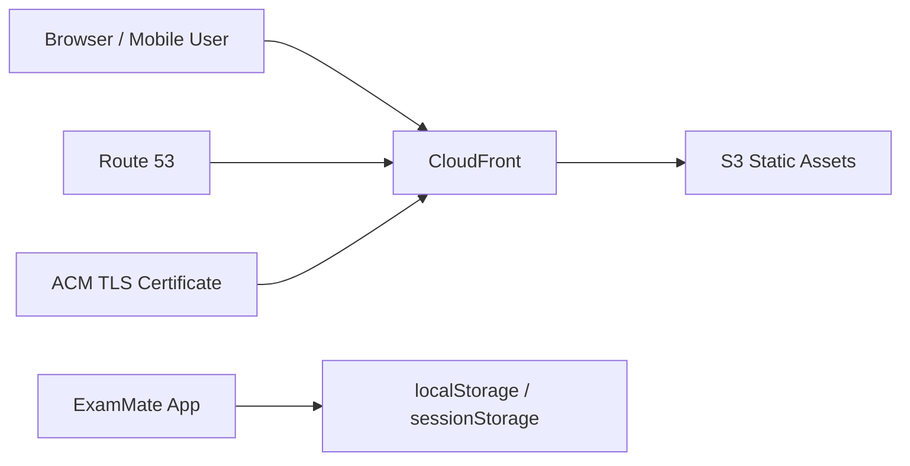

# ExamMate

<p align="center">
  <strong>AWS SAA 문제를 범위 지정으로 빠르게 풀고, 오답 복습까지 이어가는 개인 학습 웹앱</strong>
</p>

<p align="center">
  기본 문제 세트, PDF 가져오기, 일반 · 랜덤 · 시험 모드, 세트별 이어풀기와 오답 복습까지<br/>
  실제 시험 준비 흐름에 맞춰 설계된 브라우저 기반 학습 도구입니다.
</p>

<p align="center">
  <a href="https://kjjedd.cloud">Live Demo</a>
  ·
  <a href="https://www.kjjedd.cloud">Alternate Domain</a>
  ·
  <a href="./.github/workflows/deploy.yml">CI/CD Workflow</a>
</p>

<p align="center">
  <a href="https://nextjs.org/"></a>
  <a href="https://react.dev/"></a>
  <a href="https://www.typescriptlang.org/"></a>
  <a href="https://tailwindcss.com/"></a>
  <a href="https://aws.amazon.com/cloudfront/"></a>
</p>

## Why ExamMate

ExamMate는 단순히 문제를 나열하는 뷰어가 아니라, **문제 선택 → 범위 지정 → 풀이 → 결과 확인 → 오답 복습**까지 하나의 학습 루프로 이어지는 시험 대비 도구입니다.

이 프로젝트가 집중하는 가치는 분명합니다.

- 필요한 구간만 골라서 빠르게 푼다
- 학습 흐름이 끊기지 않게 이어풀기를 유지한다
- 오답과 즐겨찾기를 세트별로 관리한다
- 모바일과 데스크톱 모두에서 바로 학습에 들어갈 수 있게 만든다

서버 DB 없이도 브라우저 저장소 기반으로 학습 상태를 유지하기 때문에, 개인 시험 준비 도구로 가볍고 빠르게 사용할 수 있습니다.

## Live

- Production: [https://kjjedd.cloud](https://kjjedd.cloud)
- Alternate: [https://www.kjjedd.cloud](https://www.kjjedd.cloud)

## Preview

### Home


### Quiz


### Result


## Demo


## Core Features

### Range-first study flow

- 문제 세트를 먼저 고르고
- 시작 / 끝 번호를 지정한 뒤
- 일반 / 랜덤 / 시험 모드로 바로 진입할 수 있습니다

즉, 세트 전체를 무조건 처음부터 푸는 방식이 아니라 필요한 범위만 집중적으로 반복할 수 있습니다.

### Multiple quiz modes

- **일반 모드**: 이전 / 다음 문제를 자유롭게 이동하며 학습
- **랜덤 모드**: 선택한 범위 안에서만 문제를 섞어서 반복 학습
- **시험 모드**: 즉시 채점 없이 마지막 결과에서 한 번에 확인

### Per-set progress, favorites, and wrong answers

- 세트별 이어풀기 세션 복원
- 세트별 즐겨찾기 저장 및 삭제
- 세트별 오답 저장, 복습, 재복습

여러 문제 세트를 오가더라도 학습 흐름이 서로 섞이지 않게 유지됩니다.

### PDF import workflow

- PDF 업로드
- 파일 검증
- 문제 후보 생성
- 검수 후 저장

브라우저 환경에서 직접 처리하므로 현재는 **25MB 이하 PDF**를 지원합니다.

### Theme and reading experience

- 라이트 / 다크 모드 전환 지원
- 모바일과 데스크톱에서 문제 본문과 보기가 읽기 좋도록 밀도 조정
- 시험 준비에 방해되지 않도록 미니멀한 상호작용 유지

## Community Contributions

퍼블릭 저장소 기준으로, 문제를 풀다가 오류나 해설 부족을 발견하면 웹앱 안에서 바로 GitHub Issue를 열 수 있습니다.

- `문제 오류 제안`
- `해설 보완 제안`

이 흐름은 **자동 반영**이 아니라 **제안 → 검수 → 반영** 구조입니다.

- 사용자는 문제 번호와 현재 문맥이 채워진 이슈를 쉽게 만들 수 있습니다
- 정답은 직접 바뀌지 않습니다
- 정답 관련 제안은 근거 기반 검토 요청으로만 수집합니다
- 해설과 표현 개선은 검수 후 반영됩니다

즉, 누구나 품질 개선에 기여할 수 있지만 데이터 무결성은 유지하는 방식입니다.

## What You Can Do

| Feature | Description |
| --- | --- |
| Default Question Set | AWS SAA 기본 통합 세트 제공 |
| Verified Tail Integration | 검증된 후반 구간 문제를 기본 세트에 통합 |
| Range-based Sessions | 시작/끝 번호를 지정해 필요한 범위만 학습 |
| Quiz Modes | 일반 / 랜덤 / 시험 모드 지원 |
| Per-set Progress | 세트별 이어풀기 세션 독립 저장 |
| Per-set Favorites | 세트별 즐겨찾기 저장 및 삭제 |
| Per-set Wrong Answers | 세트별 오답 저장, 복습, 삭제 |
| PDF Import Flow | PDF 업로드, 후보 생성, 검수, 저장 흐름 지원 |
| Theme Support | 라이트 / 다크 모드 전환 지원 |
| Mobile Optimization | 모바일에서도 핵심 액션이 먼저 보이도록 최적화 |

## Study Flow

### Home

- 활성 문제 세트 선택
- 범위 지정
- 풀이 모드 선택
- 이어풀기 또는 새 세션 시작

### Quiz

- 문제 본문과 보기 중심의 집중형 화면
- 시험 모드에서는 즉시 채점 없이 답안만 저장
- 랜덤 모드와 일반 모드 모두 이전 / 다음 이동 지원

### Result and Review

- 세션 결과 요약
- 문제별 정답 / 오답 / 미응답 확인
- 오답만 다시 복습
- 복습 후 재도전 또는 홈 복귀

## Data Model

이 앱은 서버 DB 대신 **브라우저 저장소(`localStorage`, `sessionStorage`)** 를 사용합니다.

이 구조의 의미는 다음과 같습니다.

- 기본 문제 세트는 모든 사용자에게 동일하게 제공됩니다
- 사용자가 업로드한 PDF 기반 문제 세트는 해당 브라우저에만 저장됩니다
- 다른 기기나 다른 브라우저로 자동 동기화되지는 않습니다
- 브라우저 데이터를 삭제하면 개인 세트와 학습 상태도 함께 사라질 수 있습니다

즉, **공통 기본 세트 + 사용자별 개인 브라우저 저장** 구조입니다.

## Tech Stack

- **Framework**: Next.js 15 (App Router)
- **UI**: React 19
- **Language**: TypeScript
- **Styling**: Tailwind CSS
- **Storage**: `localStorage`, `sessionStorage`
- **Deploy**: AWS S3 + CloudFront + ACM + Route 53

## Deployment Architecture



## Project Structure

```text
app/
  dashboard/
  exam/
  favorites/
  import/
  quiz/
  result/
  review/

components/
  dashboard/
  exam/
  favorites/
  home/
  import/
  question/
  result/
  review/
  theme/

data/
  default-question-set-base-1-725.json
  default-question-set-saa-600-plus.json
  default-question-set-verified-726-1019.json

lib/
  data/
  dashboard/
  exam/
  import/
  quiz/
  storage/
  theme/
  types/
```

## Local Development

### Install

```bash
npm install
```

### Run

```bash
npm run dev
```

### Type Check

```bash
npm run typecheck
```

### Production Build

```bash
npm run build
```

## Deployment

ExamMate는 정적 export 결과물을 AWS에 배포합니다.

- S3
- CloudFront
- ACM
- Route 53

### CI/CD

GitHub Actions로 자동 배포됩니다.

- `pull_request -> main`
  - `typecheck`
  - `build`
- `push -> main`
  - `typecheck`
  - `build`
  - `aws s3 sync`
  - `CloudFront invalidation`

## Roadmap

- 검증된 AWS SAA 문제 세트 품질 고도화
- 가져온 문제 세트 검수 UX 개선
- 학습 통계와 대시보드 시각화 강화
- 더 세밀한 시험 시뮬레이션 옵션 추가
