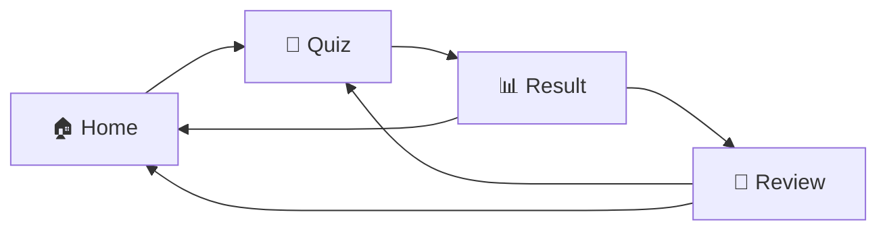
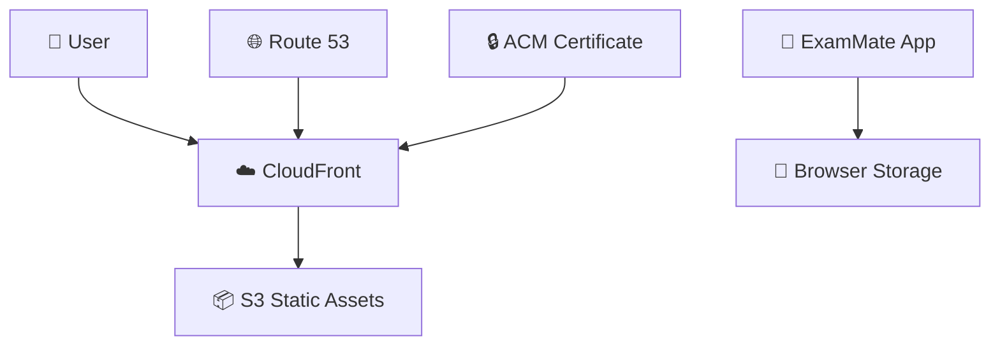

<div align="center">


# ExamMate

**AWS SAA 시험 준비를 위한 스마트 학습 플랫폼**

범위 지정 · 이어풀기 · 오답 복습까지 한 곳에서

<br/>

[](https://nextjs.org/)
[](https://react.dev/)
[](https://www.typescriptlang.org/)
[](https://tailwindcss.com/)

<br/>

[🚀 **Live Demo**](https://kjjedd.cloud) · [📖 **Documentation**](#-core-features) · [🛠️ **Tech Stack**](#-tech-stack)

</div>

<br/>

---

<br/>

## 🎯 Overview

ExamMate는 **문제 선택 → 범위 지정 → 풀이 → 결과 확인 → 오답 복습**까지 하나의 학습 루프로 이어지는 시험 대비 도구입니다.

<br/>

<div align="center">

### ✨ Key Features

</div>

<table>
<tr>
<td align="center" width="25%">
<br/>
<b>범위 지정</b><br/>
<sub>필요한 구간만<br/>골라서 학습</sub>
</td>
<td align="center" width="25%">
<br/>
<b>이어풀기</b><br/>
<sub>세션 자동 저장<br/>끊김 없는 학습</sub>
</td>
<td align="center" width="25%">
<br/>
<b>오답 관리</b><br/>
<sub>세트별 오답<br/>체계적 복습</sub>
</td>
<td align="center" width="25%">
<br/>
<b>반응형</b><br/>
<sub>모바일·데스크톱<br/>어디서나 학습</sub>
</td>
</tr>
</table>

<br/>

> 💡 **서버 DB 없이** 브라우저 저장소 기반으로 동작하여 가볍고 빠릅니다.

<br/>

---

<br/>

## 🌐 Live Demo

<div align="center">

| 🚀 Production | 🔗 Alternate |
|:---:|:---:|
| [kjjedd.cloud](https://kjjedd.cloud) | [www.kjjedd.cloud](https://www.kjjedd.cloud) |

</div>

<br/>

---

<br/>

## 📸 Screenshots

<div align="center">

### 🏠 Home


<br/><br/>

### 📝 Quiz


<br/><br/>

### 📊 Result


<br/><br/>

### 🎬 Demo Flow


</div>

<br/>

---

<br/>

## 🚀 Core Features

### 📌 Range-first Study Flow

```
1️⃣ 문제 세트 선택
2️⃣ 시작/끝 번호 지정
3️⃣ 일반/랜덤/시험 모드 선택
```

세트 전체가 아닌 **필요한 범위만** 집중 학습할 수 있습니다.

<br/>

### 🎮 Multiple Quiz Modes

| 모드 | 설명 |
|:---:|---|
| 📖 **일반 모드** | 이전/다음 문제를 자유롭게 이동하며 학습 |
| 🔀 **랜덤 모드** | 선택한 범위 내에서 문제를 섞어서 반복 학습 |
| ⏱️ **시험 모드** | 즉시 채점 없이 마지막에 한 번에 확인 |

<br/>

### 💾 Per-set Management

- ✅ 세트별 이어풀기 세션 복원
- ⭐ 세트별 즐겨찾기 저장/삭제
- ❌ 세트별 오답 저장/복습/재복습

여러 문제 세트를 오가더라도 **학습 흐름이 섞이지 않습니다**.

<br/>

### 📄 PDF Import Workflow

```
📤 PDF 업로드 → 🔍 파일 검증 → 🧩 문제 후보 생성 → ✅ 검수 후 저장
```

브라우저에서 직접 처리 (최대 **25MB**)

<br/>

### 🎨 Theme & UX

- 🌓 라이트/다크 모드 전환
- 📱 모바일 최적화 레이아웃
- 🎯 미니멀한 인터페이스

<br/>

---

<br/>

## 🤝 Community Contributions

문제 오류나 해설 부족을 발견하면 **웹앱 내에서 바로 GitHub Issue 생성**

<div align="center">

| 제안 유형 | 처리 방식 |
|:---:|---|
| 🐛 **문제 오류** | 수동 검토 후 PR 반영 |
| 💡 **해설 보완** | 자동 PR 생성 → 관리자 승인 |

</div>

> ⚠️ 정답은 직접 변경되지 않으며, 근거 기반 검토 후 반영됩니다.

<br/>

---

<br/>

## 📋 What You Can Do

<table>
<tr>
<td width="50%">

**📚 학습 기능**
- ✅ AWS SAA 기본 통합 세트 (1~1019)
- ✅ 범위 지정 학습
- ✅ 3가지 퀴즈 모드
- ✅ 세트별 진도 관리
- ✅ 즐겨찾기 & 오답 노트

</td>
<td width="50%">

**🛠️ 확장 기능**
- ✅ PDF 가져오기
- ✅ 라이트/다크 테마
- ✅ 모바일 최적화
- ✅ 브라우저 저장소 기반
- ✅ GitHub 이슈 연동

</td>
</tr>
</table>

<br/>

---

<br/>

## 🎓 Study Flow

<div align="center">



</div>

<br/>

| 단계 | 설명 |
|:---:|---|
| **🏠 Home** | 세트 선택 · 범위 지정 · 모드 선택 · 이어풀기 |
| **📝 Quiz** | 문제 풀이 · 답안 선택 · 이전/다음 이동 |
| **📊 Result** | 결과 요약 · 정답/오답 확인 · 통계 |
| **🔄 Review** | 오답 복습 · 재도전 · 홈 복귀 |

<br/>

---

<br/>

## 💾 Data Model

<div align="center">

```
🌐 기본 문제 세트 (공통)
         +
📱 브라우저 저장소 (개인)
    ├─ localStorage (문제 세트, 즐겨찾기, 오답)
    └─ sessionStorage (이어풀기 세션)
```

</div>

<br/>

> ⚠️ **주의**: 브라우저 데이터 삭제 시 개인 세트와 학습 상태가 함께 삭제됩니다.

<br/>

---

<br/>

## 🛠️ Tech Stack

<div align="center">

| Category | Technology |
|:---:|:---:|
| **Framework** | Next.js 15 (App Router) |
| **UI Library** | React 19 |
| **Language** | TypeScript 5 |
| **Styling** | Tailwind CSS 3 |
| **Storage** | localStorage · sessionStorage |
| **Deploy** | AWS S3 + CloudFront + Route 53 |

</div>

<br/>

### 🏗️ Architecture

<div align="center">



</div>

<br/>

---

<br/>

## 📁 Project Structure

```
exam-practice-app/
├─ app/                    # Next.js App Router
│  ├─ dashboard/          # 대시보드
│  ├─ exam/               # 시험 모드
│  ├─ favorites/          # 즐겨찾기
│  ├─ import/             # PDF 가져오기
│  ├─ quiz/               # 퀴즈
│  ├─ result/             # 결과
│  └─ review/             # 복습
│
├─ components/            # React 컴포넌트
│  ├─ dashboard/
│  ├─ exam/
│  ├─ home/
│  ├─ question/
│  └─ theme/
│
├─ data/                  # 문제 데이터
│  ├─ default-question-set-base-1-725.json
│  └─ default-question-set-verified-726-1019.json
│
└─ lib/                   # 유틸리티
   ├─ data/
   ├─ storage/
   └─ types/
```

<br/>

---

<br/>

## 🚀 Getting Started

### Prerequisites

```bash
Node.js 18+ required
```

<br/>

### Installation

```bash
# Clone repository
git clone https://github.com/yourusername/exam-practice-app.git

# Install dependencies
npm install
```

<br/>

### Development

```bash
# Start dev server
npm run dev

# Type check
npm run typecheck

# Build for production
npm run build
```

<br/>

---

<br/>

## 🌍 Deployment

### AWS Infrastructure

- **S3**: Static file hosting
- **CloudFront**: CDN distribution
- **ACM**: SSL/TLS certificate
- **Route 53**: DNS management

<br/>

### CI/CD Pipeline

<div align="center">

| Event | Actions |
|:---:|---|
| **PR → main** | ✅ Type check<br/>✅ Build test |
| **Push → main** | ✅ Type check<br/>✅ Build<br/>📤 S3 sync<br/>🔄 CloudFront invalidation |

</div>

<br/>

---

<br/>

## 🗺️ Roadmap

- [ ] 🎯 AWS SAA 문제 세트 품질 고도화
- [ ] 🔍 PDF 검수 UX 개선
- [ ] 📊 학습 통계 대시보드 강화
- [ ] ⏱️ 세밀한 시험 시뮬레이션 옵션
- [ ] 🔄 문제 세트 동기화 기능

<br/>

---

<br/>

<div align="center">

### 📬 Contact & Links

[🌐 Live Demo](https://kjjedd.cloud) · [📖 Documentation](#-core-features) · [🐛 Report Issue](https://github.com/yourusername/exam-practice-app/issues)

<br/>

**Made with ❤️ for AWS SAA exam preparation**

<br/>

[](LICENSE)

</div>
